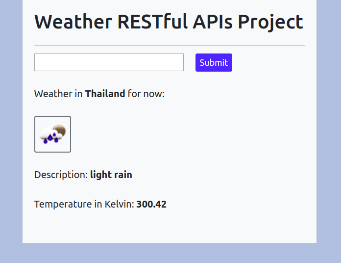

# Simple Weather RESTful API Project
____

This app uses data from the ```https://api.openweathermap.org/data/2.5/weather?q={city name}&appid={API key}``` endpoint to get info about weather description and temperature in the desired city.

Here is a simple view using the __requests__ Python library which can be installed using pip:

``` 
   pip install requests
```

### views.py

```
   from django.shortcuts import render
   from django.conf import settings
   import requests

   def home(request):
	city = {}
	api_key = settings.OPENWEATHERMAP_APP
	if 'city_name' in request.GET:
		city_name = request.GET['city_name']
		url = 'https://api.openweathermap.org/data/2.5/weather?q={0}&appid={1}'.format(city_name, api_key)
		response = requests.get(url)
		city = response.json()
	return render(request, 'app/home.html', {'city': city})
```

### urls.py

```
   from django.urls import path
   from . import views

   urlpatterns = [
       path('', views.home, name='home'),
   ]
```

### home.html

```
   

   
	<form method="get">
		<div class="row align-items-center">
			<div class="col align-self-start">
				<input class="form-control-md" type="text" name="city_name" style="font-size: 20px;">
			</div>
			<div class="col align-self-end" style="margin-bottom: 30px;">
				<button class="btn btn-primary btn-sm" type="submit" value="Submit" style="font-size: 18px;">Submit</button>
			</div>
		</div>
	</form>
	

		<p style="font-size: 20px; margin-bottom: 30px;">Weather in <strong>{{ city.name }}</strong> for now:</p>
		
		<p style="font-size: 20px; margin-bottom: 30px;">Description: <strong>{{ city.weather.0.description }}</strong></p>
		<p style="font-size: 20px; margin-bottom: 30px;">Temperature in Kelvin: <strong>{{ city.main.temp }}</strong></p>
	

   
```

As the result we get:




