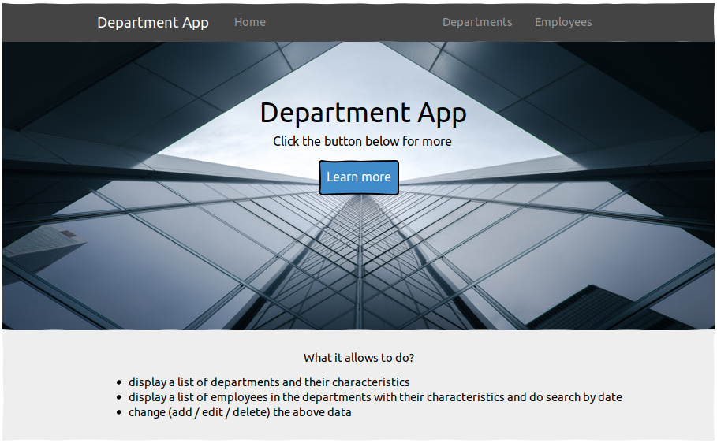

# Department App

*“Department App”* is web-application which allows users to record information about departments and employees.

Application should provide:

* Storing departments and employees in a database;
* Display a list of departments and the average salary, employee count and average age (calculated automatically) for these departments;
* Updating the list of departments (adding, editing,removing);
* Display a list of employees in the departments with an indication of the name,  salary, date of birth, age, department name for each employee;
* Updating the list of employees (adding, editing,removing);
* Filtering by a certain date for employees;
* Filtering by the period between dates for employees;

### 1. Home page

***Main scenario:***

* User selects “Home” menu item;
* Application displays home page.

<figcaption>Pic. 1.1 View the Home page.</figcaption>

